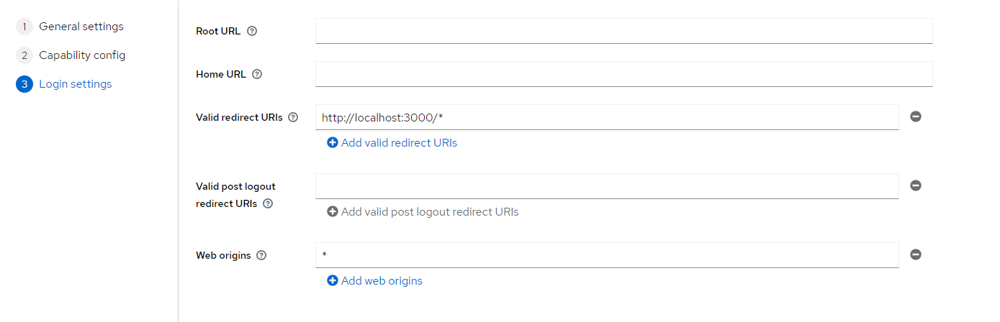

# Travel Agency (SpringBoot + React) fullstack application + ChatGPT prompt

### Project created with [YoungPrzemoDev](https://github.com/YoungPrzemoDev)

for credit of Web Application Technologies collage subject

## How it looks

### mian page:


### add travel:


### chat prompt:


## Description

First fullstack project, which combine communication backend with frontend and relational database running on cloud. It provides
authentication and role based management access to specific resources like admin panel. Regular clients can browser filtered and paginable travels and book specific travel if they are authenticated.
In the reservation page there are button "Zapytaj" which will send prompt to ChatGPT which shortly describe what we can expect from specific travel and main attraction in the city where travel is located.
After reservation clients are automatically moved to PayPal payment process.
Admin can add travels, upload image to travel description and delete them in the admin panel which is secured by role based authorization stored in JWT access token managed by keycloak.

## Technologies

### Backend: Java(SpringBoot)

### Frontend: React

### Database: MSSQL (cloud)

### Auth&autorize: Keycloak

### Features: PayPal, OpenAI

## Instalation

### 1. Clone the repo

```bash
git clone https://github.com/MatSzyman/travelAgency.git
```

### 2. Download Keycloak

Go to this [link](https://www.keycloak.org/downloads) and download keycloak locally or run it in the container

### 3. Configure Keycloak

Add database specification to the **keycloak/conf/keycloak.conf** file

```keycloak.conf
# The database vendor. example db=mssql
db=<your_db_vendor>

# The username of the database user. example db-username=admin
db-username=<your_db-username>

# The password of the database user. example db-password=12345678
db-password=<your_db-password>

# The full database JDBC URL. If not provided, a default URL is set based on the selected database vendor.
db-url=<your_db-url>
```

additionally we encouter problem with mssql and this line was solution when we have our db hosted on cloud, add this to the bottom of this file

```keycloak.conf
http-port=8081
transaction-xa-enabled=false
```

if you are using mssql on cloud paste file **quarkus.properties** from the repo to the conf folder in keycloak
thereafter, depending on which os you are using go to the bin folder and run this command ro run keycloak in development mode

Winows based:

```bash
kc.bat start-dev
```

Linux/Unix:

```bash
./kc.sh start-dev
```

if everything is working properly you might see this log:

```log
2024-02-01 10:56:31,387 INFO  [io.quarkus] (main) Profile dev activated.
2024-02-01 10:56:31,388 INFO  [io.quarkus] (main) Installed features: [agroal, cdi, hibernate-orm, jdbc-h2, jdbc-mariadb, jdbc-mssql, jdbc-mysql, jdbc-oracle, jdbc-postgresql, keycloak, logging-gelf, micrometer, narayana-jta, reactive-routes, resteasy-reactive, resteasy-reactive-jackson, smallrye-context-propagation, smallrye-health, vertx]
2024-02-01 10:56:31,390 WARN  [org.keycloak.quarkus.runtime.KeycloakMain] (main) Running the server in development mode. DO NOT use this configuration in production.
```

Then go to the [http://localhost:8081](http://localhost:8081)
and log to the admininistration console \
username: admin \
password: admin \

Create new Realm and give the Realm name: Travel-Agency as in the picture and switch to it \
 \
In the Travel-Agency Realm create 2 clients \

First create React-FE-client for frontend apllication

## Client for frontend

### Step 1

Give **ClientID** as follows


### Step 2

Click next

### Step 3

Give **Valid redirect URIs and Web orogins** as follows:


## Client for backend

### Step 1

Give **ClientId** as Spring-BA

### Step 2

Toggle **Authentication** as follows


### Step 3

Give **Valid redirect URIs and Web orogins** as follows:


## Roles

Create two roles admin and client in Realm roles
Then go to the **Clients** section \
Click on your new Spring-BA client \
Go to Client scopes -> Spring-BA-dedicated -> Add mapper -> By configuration -> User Realm Role \
Configure it as follows and click **Save**

This provides role based authorization and provide field name role to the acces token which is read in the backend

## If you are stil here there is a little bit configuration in the application.yml

Specify your db connectin

```application.yml
  datasource:
    url: your_url
    username: your_usernmae
    password: your_password
```

OpenAI API-key

```application.yml
  ai:
    openai:
      api-key: your_openai_api_key
```

PayPal sandbox acoount

```application.yml
  mode: sandbox
  client:
    id: your_id
    secret: your_secret
```

## Database script and scheme

In my repo there is a file called createDB.sql but this file have specific mssql syntax so be carefull and travel insert have id of photos which were added to db before travels insert also keep this in mind

### Database scheme looks like this


